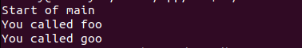

# TASK1 : Fiber Switching in C++ with Context Library

This project demonstrates the implementation of fiber switching in C++ using a provided context library. Fibers are lightweight threads with their own stack, and this example shows how to switch between different fibers.

## Table of Contents
- [TASK1 : Fiber Switching in C++ with Context Library](#task1--fiber-switching-in-c-with-context-library)
  - [Table of Contents](#table-of-contents)
  - [Introduction](#introduction)
  - [Building](#building)
  - [Running](#running)
  - [Examples](#examples)
  - [Code Snippets](#code-snippets)
    - [`context.hpp`](#contexthpp)
  - [Output](#output)
- [TASK2: Fiber Class](#task2-fiber-class)
  - [Contents](#contents)
  - [Features](#features)
  - [Usage](#usage)
  - [Implementation](#implementation)

## Introduction

In this project, we implement a simple program that utilizes the provided context library to switch between different fibers. The context library consists of functions to save and restore the execution state, allowing for the creation of lightweight fibers.


## Building

1. Assemble Assembly Code:
This command assembles the context.s assembly file into machine code and saves the result in context.o.

2. Compile C++ Source Code to Object File:
This command compiles the fibers.cpp source file into machine code and saves the result in fibers.o.

3. Link Object Files to Create Executable:
This command links the previously compiled fibers.o and context.o object files into an executable named fibers. 

```bash
as -o context.o context.s
g++ -c fibers.cpp -o fibers.o
g++ fibers.o context.o -o fibers

```
## Running
Run the compiled executable:

```bash
./fibers

```

## Examples

1. **Header Inclusions:**
   - `#include <iostream>`: Allows the program to perform input and output operations.
   - `#include <cstdint>`: Provides fixed-width integer types (`uint32_t`, `uintptr_t`, etc.).
   - `#include "context.hpp"`: Includes the header file for the provided context-switching library.

2. **Global Variables:**
   - `volatile bool x = false;`: A volatile boolean variable used to control the flow of execution. Its volatility ensures that the compiler does not optimize its usage.

3. **Global Contexts:**
   - `Context main_context;` and `Context goo_context;`: Two instances of the `Context` structure provided by the context library. These represent the execution contexts for the main function and the `goo` function.

4. **Function Declarations:**
   - `void goo();`: Forward declaration for the `goo` function.

5. **Function Definitions:**
   - `void foo()`: Outputs a message and then switches control to the `goo` function using the context-switching library.
   - `void goo()`: Outputs a message.

6. **Main Function:**
   - Allocates memory for the main stack, including additional space for the Red Zone, following the System V ABI.
   - Aligns the main stack to 16 bytes and adjusts the stack pointer for the Red Zone.
   - Retrieves the current context as the main context, sets up the `foo` function as the entry point, and sets the stack pointer.
   - Calls the context-switching library function `set_context` to switch control to the `foo` function.
   - After `foo` completes, control returns to the main function, and the program checks the condition of the volatile variable `x`. If true, it outputs a message.
   - Deallocates the main stack memory.

## Code Snippets

### `context.hpp`

```cpp
#include <cstdint>

struct Context {
    void* rip, *rsp;
    void* rbx, *rbp, *r12, *r13, *r14, *r15;
};

extern "C" int get_context(Context* c);
extern "C" void set_context(Context* c);
extern "C" void swap_context(Context* out, Context* in);

```
## Output
Task 1




# TASK2: Fiber Class

The `Fiber` class is a simple C++ implementation that provides a basic framework for creating and managing fibers. Fibers are lightweight threads of execution that can be cooperatively scheduled.

## Contents


- [Features](#features)
- [Usage](#usage)
- [Implementation](#implementation)


## Features

- **Fiber Creation:** Create fibers with a specified function to execute.
- **Context Switching:** Swap the execution context between different fibers.
- **Stack Management:** Allocate and deallocate stack space for each fiber.

## Usage

To use the `Fiber` class, follow these steps:

1. Include the "Fiber.hpp" header file in your project.
2. Create a `Fiber` object with the desired function.
3. Use the provided functions to get, set, and swap the context of fibers.
4. Start the execution of fibers to switch between them.

```cpp
#include "Fiber.hpp"
#include <iostream>

int main() {
    // Example usage of the Fiber class
    Fiber fooFiber(&fooFunction);
    Fiber barFiber(&barFunction);

    const Context &fooContext = fooFiber.get_context();
    fooFiber.set_context(barFiber.get_context());

    // Start the execution of fibers to switch between them
    fooFiber.start_execution(barFiber);

    return 0;
}


```

## Implementation
The Fiber class is implemented with the following key functions:

- Fiber::Fiber(): Default constructor for initializing the fiber.
- Fiber::Fiber(void (*function)()): Constructor for creating a fiber with a specified function.
- Fiber::~Fiber(): Destructor for cleaning up resources, such as deallocating the stack.
- Fiber::get_context(): Retrieve the context of the fiber.
- Fiber::set_context(const Context &newContext): Set the context of the fiber.
- Fiber::swap_context(Fiber &other): Swap the context between two fibers.
- Fiber::start_execution(Fiber &other): Start the execution of the specified 